## Arabidopsis_TMR
#Transcriptional Master Regulators of mild drought in growing Arabidopsis leaves

El conjunto original de datos se encuentra ebi.ac.uk. Corresponden a expresión celular de mismo componente de la hoja (mismo tejido) de plantas de _A. thaliana_ de diferentes regiones del mundo. El artículo original es: 10.1105/tpc.16.00483

La lista de TF fue obtenida de "Plant Transcription Factor Database" (planttfdb.cbi.pku.edu.cn).

## CORTO

corto (Correlation Tool) es un paquete de R par generar redes de regulación genética basadas en correlaciones con DPI.

Los primero TFs mejor ranqueados de corto fueron:

|   Regulon   |  NES  |  p.value |
|-------------|-------|----------|
| AT2G46680.1 | 6.23  | 4.74e-10 |
| AT3G24520.1 | 5.26  | 1.46e-07 |
| AT3G50650.1 | 4.86  | 1.19e-06 |
| AT1G22190.1 | 4.49  | 7.21e−06 |
| AT2G19810.1 | 4.46  | 8.07e−06 | 
| AT5G03680.1 | 4.2   | 2.65e−05 |
| AT5G47640.1 | 4.12  | 3.77e−05 |
| AT3G61890.1 | 4.11  | 3.9e−05  |
| AT3G19360.1 | −3.92 | 8.98e−05 |
| AT2G27050.1 | 3.76  | 0.000169 |

Una búsqueda rápida en arabidopsis.org de estos genes se encontró esta descripción. Las imágenes corresponden al Arabidopsis eFP Browser, Abiotic Stress II:

[**AT2G46680.1**](https://www.arabidopsis.org/servlets/TairObject?type=locus&name=AT2G46680)
Other names: ARABIDOPSIS THALIANA HOMEOBOX 7, ATHB-7, ATHB7, HB-7, HOMEOBOX 7
>Encodes a putative transcription factor that contains a homeodomain closely linked to a leucine zipper motif. Transcript is detected in all tissues examined. Is transcriptionally regulated in an ABA-dependent manner and may act in a signal transduction pathway which mediates a drought response.

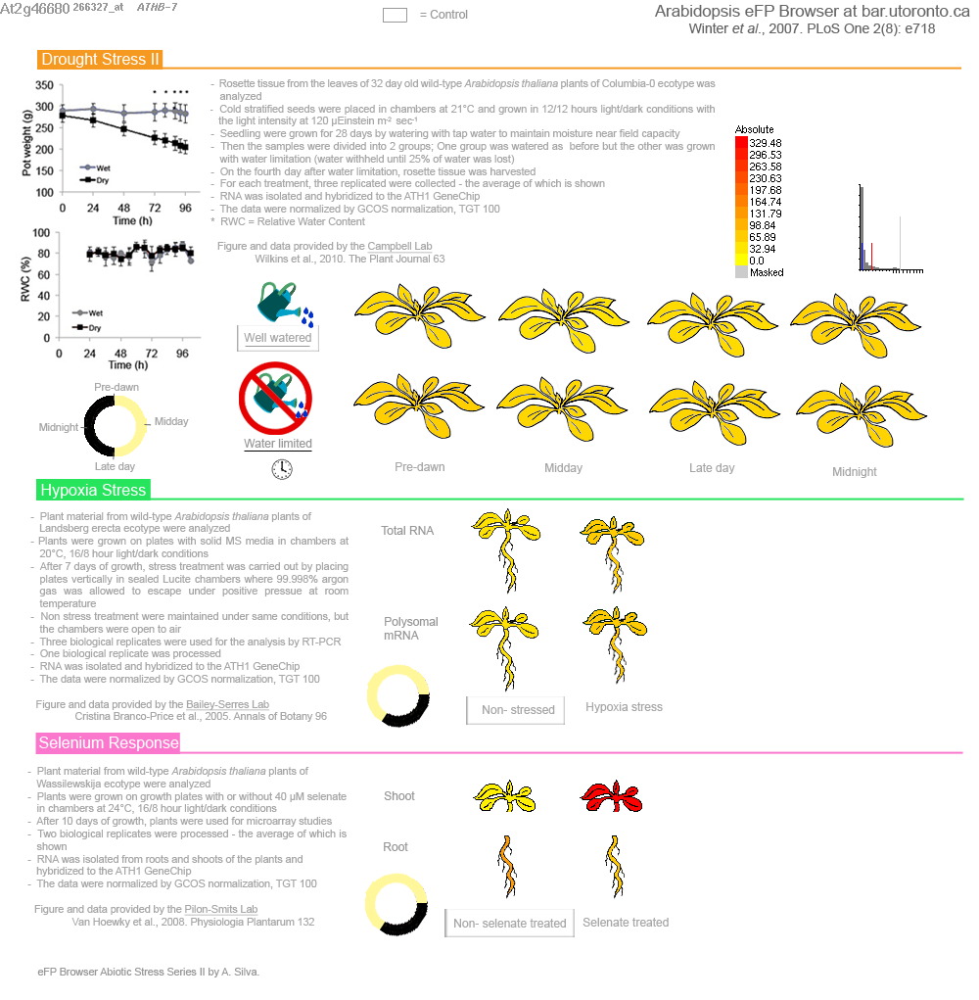
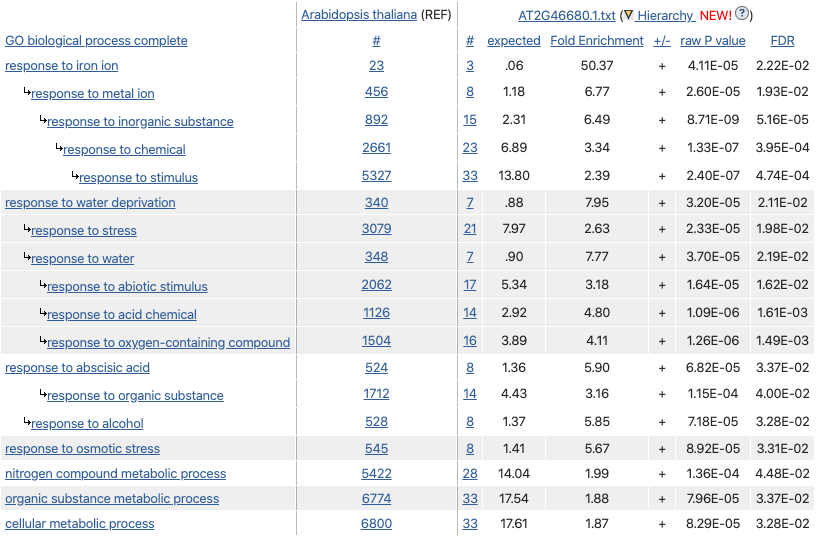

[**AT3G24520.1**](https://www.arabidopsis.org/servlets/TairObject?id=38672&type=locus)
Other names: AT-HSFC1, HEAT SHOCK TRANSCRIPTION FACTOR C1, HSFC1
>member of Heat Stress Transcription Factor (Hsf) family

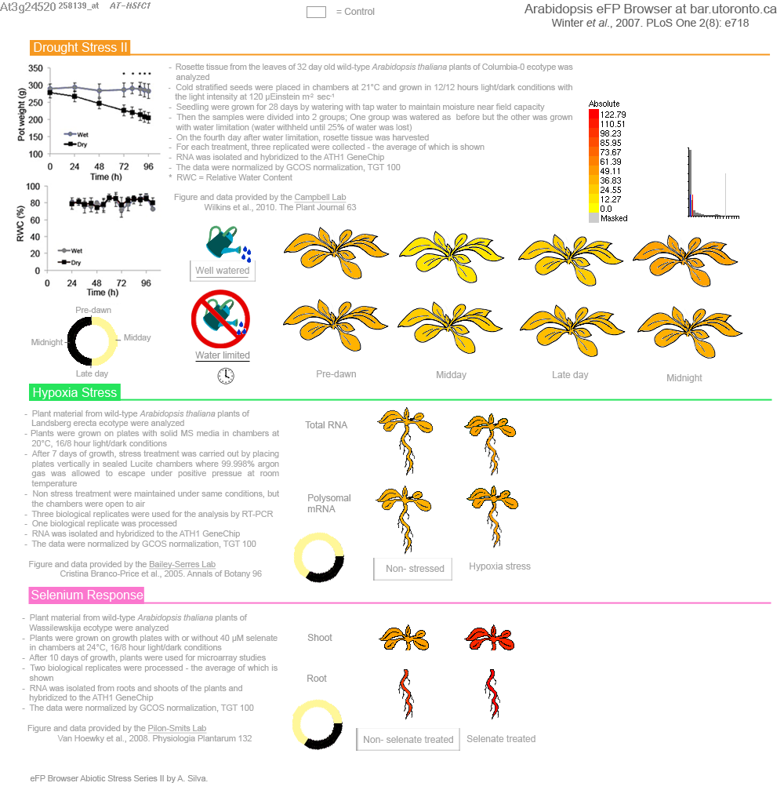

[**AT3G50650.1**](https://www.arabidopsis.org/servlets/TairObject?id=40365&type=locus)
>GRAS family transcription factor;(source:Araport11)

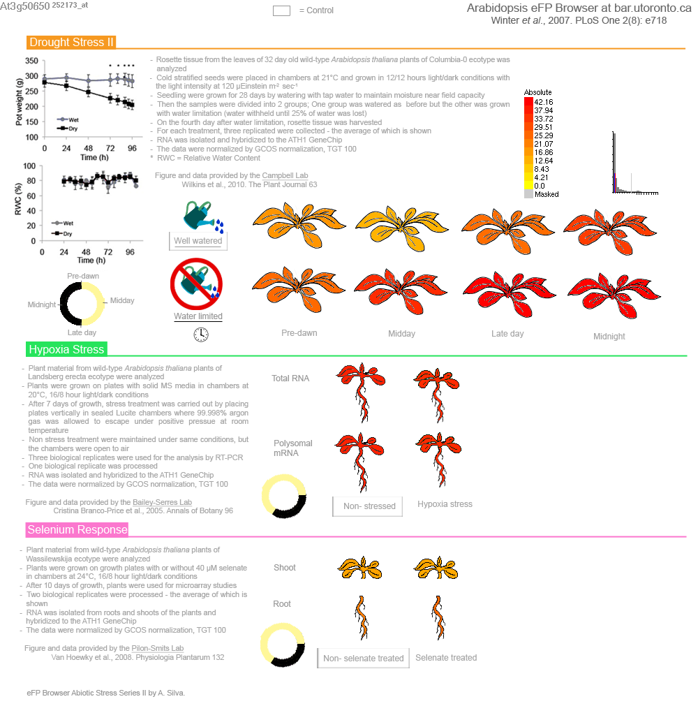

[**AT1G22190.1**](https://www.arabidopsis.org/servlets/TairObject?id=27983&type=locus)
Other names: RAP2.4, RAP2.4D, RELATED TO AP2 4, RELATED TO AP2.4D, WIND2
>The gene encodes a putative transcription factor belongings to the abiotic stress-associated DREB A-6 clade. The mRNA is cell-to-cell mobile.

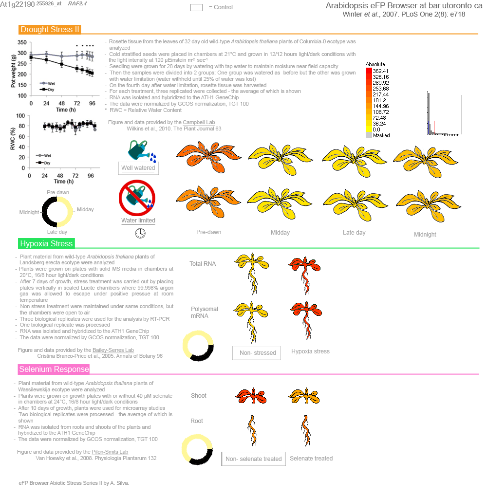

[**AT2G19810.1**](https://www.arabidopsis.org/servlets/TairObject?id=33301&type=locus)
Other names: ATOZF1, ATTZF2, OXIDATION-RELATED ZINC FINGER 1, OZF1, TANDEM ZINC FINGER 2, TZF2
>Encodes Oxidation-related Zinc Finger 1 (OZF1), a plasma membrane protein involved in oxidative stress.

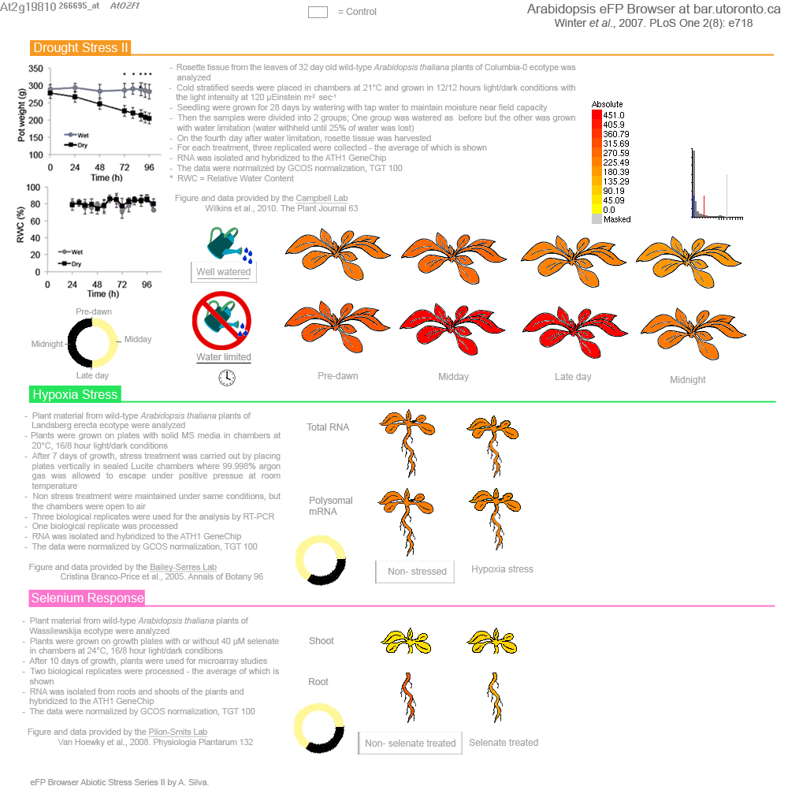

[**AT5G03680.1**](https://www.arabidopsis.org/servlets/TairObject?id=130655&type=locus)
Other names: PETAL LOSS, PTL
>Recessive mutations are defective in organ initiation and orientation in the second whorl. This gene encodes a trihelix transcription factor whose expression is limited to margins of floral and vegetative organs. Overexpression and double mutant analyses suggest that this gene is involved in limiting lateral growth of organs.

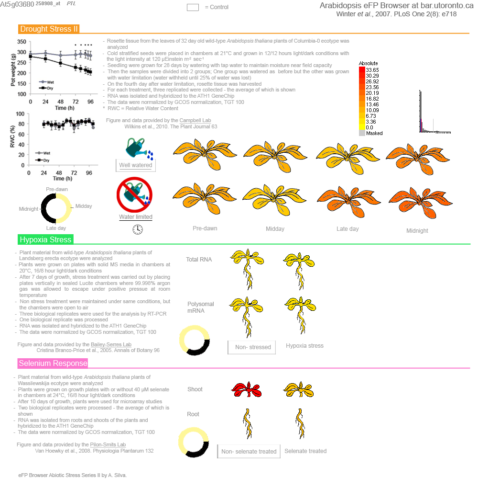

[**AT5G47640.1**](https://www.arabidopsis.org/servlets/TairObject?id=133940&type=locus)
Other names: "NUCLEAR FACTOR Y, SUBUNIT B2", NF-YB2
>Involved in the regulation of response to nutrient levels.

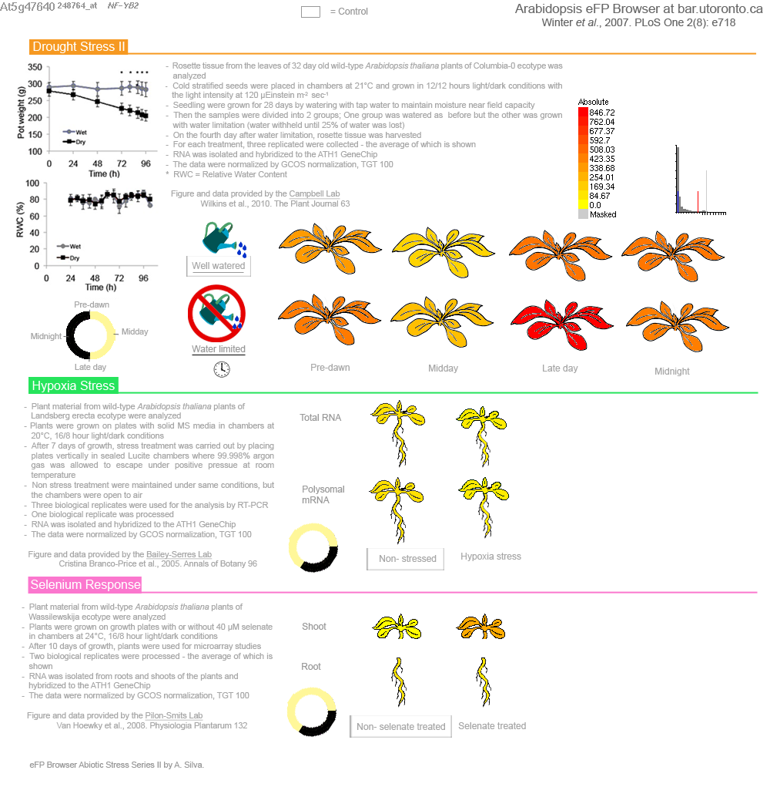

[**AT3G61890.1**](https://www.arabidopsis.org/servlets/TairObject?id=36510&type=locus)
Other names: ARABIDOPSIS THALIANA HOMEOBOX 12, ATHB-12, ATHB12, HB-12, HB12, HOMEOBOX 12
>Encodes a homeodomain leucine zipper class I (HD-Zip I) protein. Loss of function mutant has abnormally shaped leaves and stems.

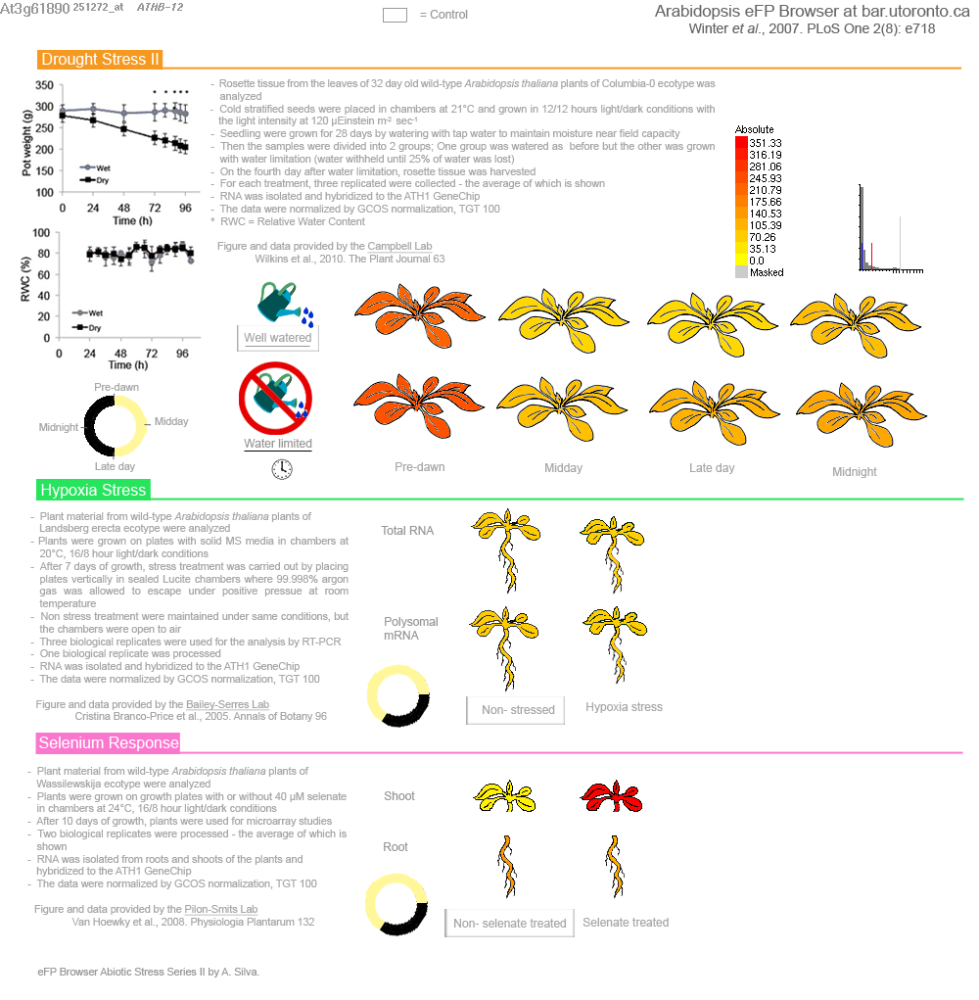

[**AT3G19360.1**](https://www.arabidopsis.org/servlets/TairObject?id=38478&type=locus)
Other names: ARABIDOPSIS THALIANA HOMEOBOX 12, ATHB-12, ATHB12, HB-12, HB12, HOMEOBOX 12
>Zinc finger (CCCH-type) family protein;(source:Araport11)

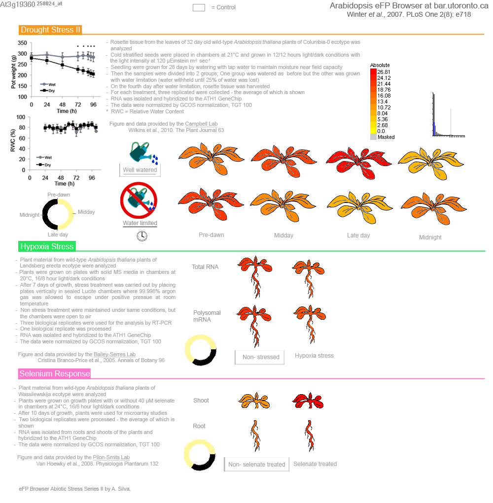

[**AT2G27050.1**](https://www.arabidopsis.org/servlets/TairObject?id=34443&type=locus)
Other names: ATEIL1, EIL1, ETHYLENE-INSENSITIVE3-LIKE 1
>ethylene-insensitive3-like1 (EIL1) The mRNA is cell-to-cell mobile.

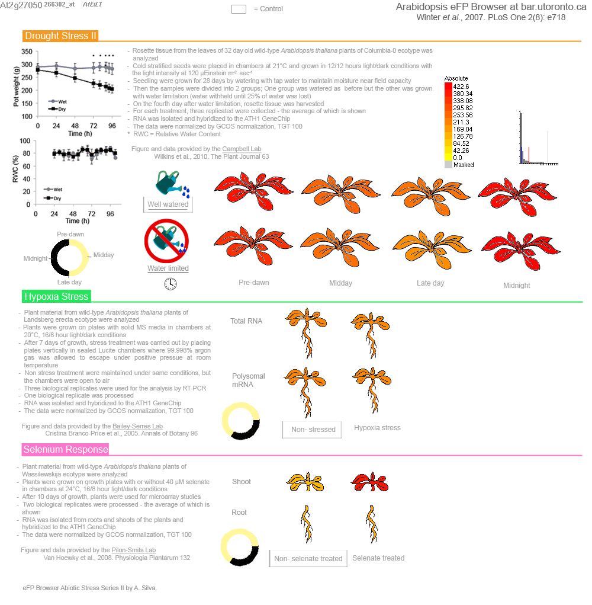

## MARINa

El acercamiento con MARINa (Lefebvre 2010, doi: 10.1038/msb.2010.31) produjo estos resultados.

Los resultados se despliegan a continuación:

|             |    Regulon  | Size | NES  | p.value |  FDR  |  
| ----------- | ----------- | ---- | ---- | ------- | ----- |  
| AT1G30330.2 | AT1G30330.2 |  148 | 2.63 | 0.00854 | 0.709 |  
| AT2G17770.2 | AT2G17770.2 |   96 | 2.41 | 0.01600 | 0.709 |  
| AT2G47070.1 | AT2G47070.1 |   26 | 2.39 | 0.01670 | 0.709 |  
| AT3G10000.1 | AT3G10000.1 |   25 | 2.10 | 0.03540 | 0.936 |  
| AT2G02070.1 | AT2G02070.1 |   33 | 1.91 | 0.05570 | 0.936 |  
| AT2G30590.1 | AT2G30590.1 |   56 | 1.90 | 0.05710 | 0.936 |  
| AT1G28520.1 | AT1G28520.1 |  159 | 1.90 | 0.05710 | 0.936 |  
| AT1G27360.1 | AT1G27360.1 |   37 | 1.87 | 0.06190 | 0.936 |  
| AT1G19790.1 | AT1G19790.1 |  231 | 1.85 | 0.06410 | 0.936 |  
| AT1G71260.1 | AT1G71260.1 |  111 |-2.85 | 0.00432 | 0.709 |  

Sin embargo hay que notar que solo cuatro reguladores tiene una _p_ significativa. 
El sitio [arabidopsis.org](https://www.arabidopsis.org/servlets/TairObject?type=locus&name=At1g71260) describe los significativos como así:

**AT1G71260.1**
Other names: ATWHY2, WHIRLY 2, WHY2
>Encodes WHY2, a homolog of the potato p24 protein. It shares the conserved KGKAAL domain, a putative DNA-binding domain, with potato p24 and is localized to mitochondria and not the nucleus. WHY2 is a member of the Whirly family proteins present mainly in the plant kingdom performing various activities related to DNA metabolism. Crystal structure of Solanum tuberosum WHY2, a close homolog of Arabidopsis WHY2, reveal that Whirly proteins bind to single strand DNA to promote accurate repair of DNA double-strand breaks over an error-prone repair pathway.

**AT1G30330.2**
Other names: ARF6, AUXIN RESPONSE FACTOR 6
>Encodes a member of the auxin response factor family. Mediates auxin response via expression of auxin regulated genes. Acts redundantly with ARF8 to control stamen elongation and flower maturation. Expression of ARF6 is controlled by miR167.

**AT2G17770.2**
Other names: ATBZIP27, BASIC REGION/LEUCINE ZIPPER MOTIF 27, BZIP27, FD PARALOG, FDP
>Encodes a paralog of bZIP transcription factor FD. This protein interacts with FD and FT.

**AT2G47070.1**
Other names: SPL1, SQUAMOSA PROMOTER BINDING PROTEIN-LIKE 1
>member of SPL gene family, encodes DNA binding proteins and putative transcription factors. All have the SBP-box, which encodes the SBP-domain, required for and sufficient for interaction with DNA.
