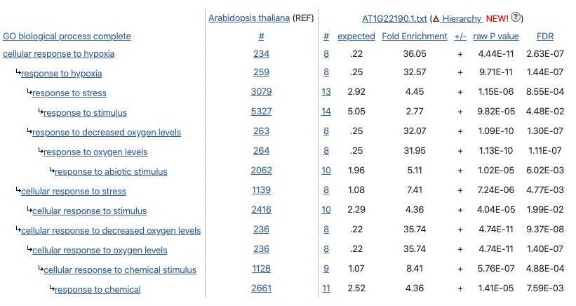
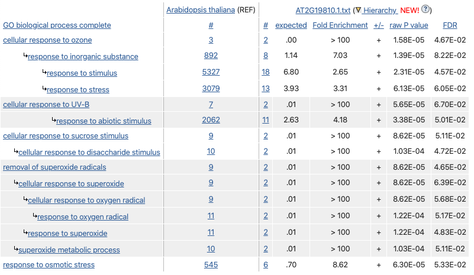
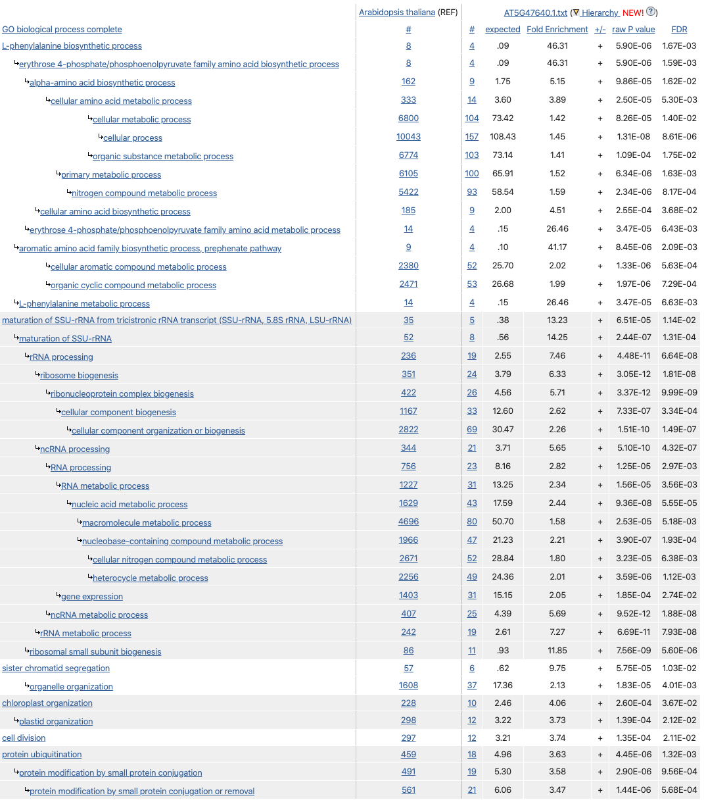
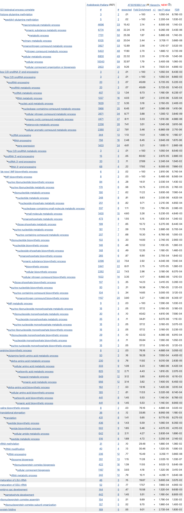

## Arabidopsis_TMR
#Transcriptional Master Regulators of mild drought in growing Arabidopsis leaves

El conjunto original de datos se encuentra ebi.ac.uk. Corresponden a expresión celular de mismo componente de la hoja (mismo tejido) de plantas de _A. thaliana_ de diferentes regiones del mundo. El artículo original es: 10.1105/tpc.16.00483

La lista de TF fue obtenida de "Plant Transcription Factor Database" (planttfdb.cbi.pku.edu.cn).

## CORTO

corto (Correlation Tool) es un paquete de R par generar redes de regulación genética basadas en correlaciones con DPI.

Los primero TFs mejor ranqueados de corto fueron:

|   Regulon   |  NES  |  p.value |
|-------------|-------|----------|
| AT2G46680.1 | 6.23  | 4.74e-10 |
| AT3G24520.1 | 5.26  | 1.46e-07 |
| AT3G50650.1 | 4.86  | 1.19e-06 |
| AT1G22190.1 | 4.49  | 7.21e−06 |
| AT2G19810.1 | 4.46  | 8.07e−06 | 
| AT5G03680.1 | 4.2   | 2.65e−05 |
| AT5G47640.1 | 4.12  | 3.77e−05 |
| AT3G61890.1 | 4.11  | 3.9e−05  |
| AT3G19360.1 | −3.92 | 8.98e−05 |
| AT2G27050.1 | 3.76  | 0.000169 |

### Información de los RTMs

Una búsqueda rápida en arabidopsis.org de estos genes se encontró esta descripción. Las imágenes corresponden al Arabidopsis eFP Browser, Abiotic Stress II. 

El cuadro corresponde al análisis de sobrerepresentación del regulón de cada TMR (todos sus blancos) usando:

Analysis Type: PANTHER Overrepresentation Test (Released 20190711)
Annotation Version and Release Date: GO Ontology database Released 2019-12-09
Reference List: Arabidopsis thaliana (all genes in database).

#### [**ATHB7 (AT2G46680.1)**](https://www.arabidopsis.org/servlets/TairObject?type=locus&name=AT2G46680)
Other names: ARABIDOPSIS THALIANA HOMEOBOX 7, ATHB-7, ATHB7, HB-7, HOMEOBOX 7

Encodes a putative transcription factor that contains a homeodomain closely linked to a leucine zipper motif. Transcript is detected in all tissues examined. Is transcriptionally regulated in an ABA-dependent manner and may act in a signal transduction pathway which mediates a drought response.

**_ATHB7 Arabidopsis eFP Browser, Abiotic Stress II_**

**_ATHB7 Regulon Overrepresentation Test_**

#### [**HSFC1 (AT3G24520.1)**](https://www.arabidopsis.org/servlets/TairObject?id=38672&type=locus)
Other names: AT-HSFC1, HEAT SHOCK TRANSCRIPTION FACTOR C1, HSFC1

member of Heat Stress Transcription Factor (Hsf) family

**_HSFC1 Arabidopsis eFP Browser, Abiotic Stress II_**

**_HSFC1 Regulon Overrepresentation Test_**

#### [**AT3G50650.1**](https://www.arabidopsis.org/servlets/TairObject?id=40365&type=locus)

GRAS family transcription factor;(source:Araport11)

**_AT3G50650 Arabidopsis eFP Browser, Abiotic Stress II_**

**_AT3G50650 Regulon Overrepresentation Test_**

#### [**RAP2.4 (AT1G22190.1)**](https://www.arabidopsis.org/servlets/TairObject?id=27983&type=locus)
Other names: RAP2.4, RAP2.4D, RELATED TO AP2 4, RELATED TO AP2.4D, WIND2

The gene encodes a putative transcription factor belongings to the abiotic stress-associated DREB A-6 clade. The mRNA is cell-to-cell mobile.

**_RAP2.4 Arabidopsis eFP Browser, Abiotic Stress II_**

**_RAP2.4 Regulon Overrepresentation Test_**

#### [**ATOZF1 (AT2G19810.1)**](https://www.arabidopsis.org/servlets/TairObject?id=33301&type=locus)
Other names: ATOZF1, ATTZF2, OXIDATION-RELATED ZINC FINGER 1, OZF1, TANDEM ZINC FINGER 2, TZF2

Encodes Oxidation-related Zinc Finger 1 (OZF1), a plasma membrane protein involved in oxidative stress.

**_ATOZF1 Arabidopsis eFP Browser, Abiotic Stress II_**

**_ATOZF1 Regulon Overrepresentation Test_**

#### [**PETAL LOSS (AT5G03680.1)**](https://www.arabidopsis.org/servlets/TairObject?id=130655&type=locus)
Other names: PETAL LOSS, PTL
>Recessive mutations are defective in organ initiation and orientation in the second whorl. This gene encodes a trihelix transcription factor whose expression is limited to margins of floral and vegetative organs. Overexpression and double mutant analyses suggest that this gene is involved in limiting lateral growth of organs.

**_PETAL LOSS Arabidopsis eFP Browser, Abiotic Stress II_**

**_PETAL LOSS Regulon Overrepresentation Test_**

#### [**NF-YB2 (AT5G47640.1)**](https://www.arabidopsis.org/servlets/TairObject?id=133940&type=locus)
Other names: "NUCLEAR FACTOR Y, SUBUNIT B2", NF-YB2
>Involved in the regulation of response to nutrient levels.

**_NF-YB2 Arabidopsis eFP Browser, Abiotic Stress II_**

**_NF-YB2 Regulon Overrepresentation Test_**

#### [**ATHB12 (AT3G61890.1)**](https://www.arabidopsis.org/servlets/TairObject?id=36510&type=locus)
Other names: ARABIDOPSIS THALIANA HOMEOBOX 12, ATHB-12, ATHB12, HB-12, HB12, HOMEOBOX 12
>Encodes a homeodomain leucine zipper class I (HD-Zip I) protein. Loss of function mutant has abnormally shaped leaves and stems.

**_ATHB12 Arabidopsis eFP Browser, Abiotic Stress II_**

**_ATHB12 Regulon Overrepresentation Test_**

#### [**AT3G19360.1**](https://www.arabidopsis.org/servlets/TairObject?id=38478&type=locus)
Other names:
>Zinc finger (CCCH-type) family protein;(source:Araport11)

**_AT3G19360.1 Arabidopsis eFP Browser, Abiotic Stress II_**

**_AT3G19360.1 Regulon Overrepresentation Test_**

#### [**EIL1 (AT2G27050.1)**](https://www.arabidopsis.org/servlets/TairObject?id=34443&type=locus)
Other names: ATEIL1, EIL1, ETHYLENE-INSENSITIVE3-LIKE 1
>ethylene-insensitive3-like1 (EIL1) The mRNA is cell-to-cell mobile.

**_EIL1 Arabidopsis eFP Browser, Abiotic Stress II_**

**_EIL1 Regulon Overrepresentation Test_**

